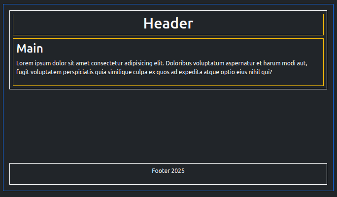

This is a useful trick when the content of a page is short and the footer is left hovering mid page. This could happen where the homepage of a new blog/portfolio which lists posts and projects, does not have much content yet. In this case we want the footer to be pushed down like  in the picture below. Bootstrap classes are used here, so bootstrap needs to be loaded in the head as usual.



 In the code snippet below, the first ```<div>``` is a container for all the page content i.e. the ```<header>```, ```<main>``` and ```<footer>``` sections (blue border in the picture). The second ```<div>``` (white border) , nested within the first, contains the page content (header and main sections) excluding the ```<footer>``` element. 


```html
....
<body>
    <div class="d-flex flex-column justify-content-between min-vh-100">
        <div>
            <header>
                ....
            </header>
            <main>
                ....
            </main>
        </div>
        <!--space between here -->
        <footer>
            ....
        </footer>
    </div>
</body>
....
```
The first ```<div>``` has a few bootstrap classes applied. The ```.min-vh-100``` class ensures that the contents of this ```<div>``` take up at least the full viewport height. The ```.d-flex``` class makes the ```<div>``` into a flex container and its child elements into flex-items. The ```.flex-column``` class sets the flex-direction. There are two immediate child elements in this case, (both indicated by a white border) - firstly the ```<div>``` containing the ```<header>``` and ```<main>``` elements, and secondly the ```<footer>``` element. To get the desired effect when the content is short, the ```<footer>``` element must be pushed down the page from where the main content ends, to the page bottom. The ```.justify-content-between``` class tells the browser that any extra space remaining in the parent containing ```<div>``` not taken up by the content, should be placed between the flex-items i.e. the child elements. The two child elements in this case are the ```<div>``` containing the ```<header>``` and ```<main>``` elements and the ```<footer>``` element. So when the page has short content the left-over space goes between the end of the main content and the ```<footer>```, thus pushing the latter to the page bottom.